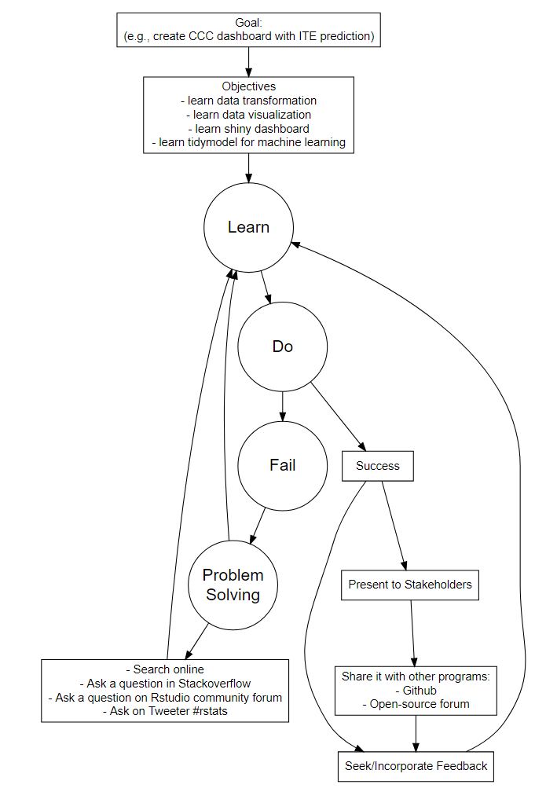

# Open GME
We encourage medical educators (program directors, associate program directors, assistant program directors, core faculty and also administrators) to immerse themselves in a zone of proximal development and acquire new skill and intuition of data science in a data-abundant and driven era to better data literacy in GME.

Below are our steps in learning Data Science in a comfortable pace. If any of the link below is not working, please feel free to email/message/submit an issue and we will either fix the broken link or suggest a different course which is of similar concept and quality.

-----

# Data Science Tutorials
## Step 1: Data Structure Manipulation/Transformation (1 month)
### Guided tutorials (subscription)
- [Data manipulation with dplyr](https://app.datacamp.com/learn/courses/data-manipulation-with-dplyr)
- [Working with data in the Tidyverse](https://app.datacamp.com/learn/courses/working-with-data-in-the-tidyverse)
- [Joining data with dplyr](https://app.datacamp.com/learn/courses/joining-data-with-dplyr)

### Free tutorials (highly recommended)
- [R 4 Data Science: Transform](https://r4ds.had.co.nz/transform.html)

### Cheat sheet:
- [R: Data Transformation](https://github.com/rstudio/cheatsheets/blob/main/data-transformation.pdf)
- [R: Data Tidying with Tidyr](https://raw.githubusercontent.com/rstudio/cheatsheets/main/tidyr.pdf)
- [R: String manipulation with stringr](https://raw.githubusercontent.com/rstudio/cheatsheets/main/strings.pdf)
- [R: Date and times with lubridate](https://raw.githubusercontent.com/rstudio/cheatsheets/main/lubridate.pdf)

## Step 2: Data Visualization (1 month)
### Guided tutorials (subscription)
- [Introduction to Data Visualization with ggplot2](https://app.datacamp.com/learn/courses/introduction-to-data-visualization-with-ggplot2)
- [Intermediate Data Visualization with ggplot2](https://app.datacamp.com/learn/courses/intermediate-data-visualization-with-ggplot2)
- [Interactive Data Visualization with plotly in R](https://app.datacamp.com/learn/courses/interactive-data-visualization-with-plotly-in-r)
- [Visualization Best Practices in R](https://app.datacamp.com/learn/courses/visualization-best-practices-in-r)

### Free tutorials (highly recommended):
- [R 4 Data Science: Data Visualization](https://r4ds.had.co.nz/data-visualisation.html)

### Cheat sheet:
- [R: Data visualization with ggplot2](https://raw.githubusercontent.com/rstudio/cheatsheets/main/data-visualization.pdf)

## Step 3: Shiny Dashboard (1 month)
### Guided tutorial (subscription)
- [Building dashboards with Shinydashboard](https://app.datacamp.com/learn/courses/building-dashboards-with-shinydashboard)
- [Case studies building Web Applications with Shiny in R](https://app.datacamp.com/learn/courses/case-studies-building-web-applications-with-shiny-in-r)

### Free tutorial:
- [Mastering Shiny](https://mastering-shiny.org/)

### Cheat sheet:
- [R: Shiny](https://raw.githubusercontent.com/rstudio/cheatsheets/main/shiny.pdf)

## Step 4: Machine Learning through Tidymodels (1 month)
### Guided tutorial (subscription)
- [Modeling with Tidymodels in R](https://app.datacamp.com/learn/courses/modeling-with-tidymodels-in-r)

### Free tutorials 
- [Tidymodels](https://www.tidymodels.org/start/)

-----

# CCC Dashboard
- [Shiny CCC Dashboard Example](https://kenkoonwong.shinyapps.io/opengme_ccc/)
- [CCC Dashboard Example R Script](https://github.com/kenkoonwong/open_gme/blob/main/CCC/CCC_demo.R)
- [CCC Mock Data](https://github.com/kenkoonwong/open_gme/blob/main/CCC/cccdb_fake.rda)

# Ranking Algorithm
- [Ranking Algorithm Dashboard](https://kenkoonwong.shinyapps.io/opengme_rank/)
- [Rank R script](https://github.com/kenkoonwong/open_gme/blob/main/rank/rank_demo.R)
- [Rank Mock Data](https://github.com/kenkoonwong/open_gme/blob/main/rank/rank_fake.rda)

# ITE Machine Learning Model
- [ITE Machine Learning Model R script](https://github.com/kenkoonwong/open_gme/blob/main/ite_ml/ite_ml.Rmd)
- [ITE Mock Data](https://github.com/kenkoonwong/open_gme/blob/main/ite_ml/ite_fake.rda)

------
# Learning DS Framework

